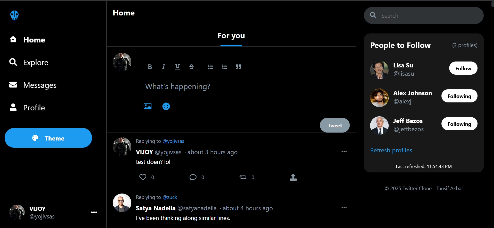

# 🐦 Twitter Clone

A full-featured Twitter (X) clone built with the MERN stack (MongoDB, Express, React, Node.js) featuring real-time messaging, media uploads, and a responsive design.

---

## 🖼️ **Live Preview**

**Below is a screenshot of the application in action:**



> **🎯 Main Showcase Image** - This is the primary screenshot that will be displayed prominently on GitHub

**💡 Note:** Once you add the actual screenshot file to the `screenshots/` folder, GitHub will automatically display it here, making your repository look professional and engaging!

## ✨ Features

### 🔐 User Authentication
- ✅ User registration and login with email
- ✅ JWT-based authentication
- ✅ Secure password hashing
- ✅ Protected routes

### 👤 User Profile Management
- ✅ Customizable profile pictures and cover photos
- ✅ Editable bio and personal information
- ✅ Follower/Following system with real-time updates
- ✅ Profile editing capabilities

### 📝 Post Management
- ✅ Create, read, update, and delete posts
- ✅ Like and retweet functionality
- ✅ Reply system with threaded conversations
- ✅ Media uploads (images & videos)
- ✅ Character limit enforcement
- ✅ Hashtag support and trending topics

### 🏠 Timeline & Navigation
- ✅ Home timeline (posts from followed users)
- ✅ Explore page with trending content
- ✅ User profile timelines
- ✅ Search functionality across users and posts

### 💬 Real-time Communication
- ✅ Direct messaging system
- ✅ Real-time notifications
- ✅ Socket.io integration for live updates

### 🎨 User Interface
- ✅ Responsive design (mobile-first approach)
- ✅ Light/Dark theme toggle
- ✅ Modern, Twitter-like interface
- ✅ Emoji picker integration
- ✅ Media previews and attachments

## 🛠️ Tech Stack

### Frontend
- **React.js 18** - Modern React with hooks
- **Redux Toolkit** - State management
- **React Router 6** - Client-side routing
- **Styled Components** - CSS-in-JS styling
- **Socket.io Client** - Real-time communication
- **Axios** - HTTP client for API requests
- **React Icons** - Icon library
- **Emoji Picker React** - Emoji selection

### Backend
- **Node.js** - JavaScript runtime
- **Express.js** - Web application framework
- **MongoDB** - NoSQL database
- **Mongoose** - MongoDB object modeling
- **Socket.io** - Real-time bidirectional communication
- **JWT** - JSON Web Token authentication

### Security & Performance
- **bcryptjs** - Password hashing
- **Helmet** - Security headers
- **CORS** - Cross-origin resource sharing
- **Rate Limiting** - API protection
- **Input Validation** - Data sanitization
- **Multer** - File upload handling

## 📱 Screenshots

- [Login Page](screenshots/login.png) - User authentication interface
- [Main Home Dashboard](screenshots/home-dashboard.png) - Primary timeline view (Main showcase image)
- [User Profile](screenshots/user-profile.png) - Individual user profiles
- [Explore Page](screenshots/explore.png) - Trending topics and discover content
- [Direct Messages](screenshots/messages.png) - Chat conversations
- [Post Creation](screenshots/post-creation.png) - Tweet composition
- [Search Results](screenshots/search.png) - User and post search functionality
- [Profile Editing](screenshots/profile-edit.png) - Profile customization
- [Purple Theme](screenshots/purple-theme.png) - Custom purple theme
- [Light Theme](screenshots/light-theme.png) - Custom light theme
- [Green Theme](screenshots/green-theme.png) - Custom green theme
- [Orange Theme](screenshots/orange-theme.png) - Custom orange theme
- [Pink Theme](screenshots/pink-theme.png) - Custom pink theme
- [Image Upload](screenshots/media-upload.png) - Image Attachment (*)
- [Video Upload](screenshots/media-upload-video.png) - Video Attachment
- [Followers](screenshots/followers.png) - Social connections
- [Following](screenshots/following.png) - Social connections
- [Tablet View](screenshots/tablet-view.png) - Medium screen adaptation
- [Mobile View](screenshots/mobile-view.png) - Mobile-optimized interface

## 🚀 Getting Started

### Prerequisites

Before running this application, make sure you have the following installed:

- **Node.js** (v14 or higher) - [Download here](https://nodejs.org/)
- **MongoDB** - [Download here](https://www.mongodb.com/try/download/community) or use [MongoDB Atlas](https://www.mongodb.com/atlas)
- **Git** - [Download here](https://git-scm.com/downloads)

### Installation

1. **Clone the repository**
   ```bash
   git clone https://github.com/yourusername/twitter-clone.git
   cd twitter-clone
   ```

2. **Install all dependencies**
   ```bash
   npm run install-all
   ```

3. **Environment Setup**
   
   Create a `config.env` file in the `server/config/` directory:
   ```env
   PORT=5000
   NODE_ENV=development
   MONGODB_URI=mongodb://localhost:27017/twitter-clone
   JWT_SECRET=your_super_secret_jwt_key_here
   JWT_EXPIRE=30d
   CLIENT_URL=http://localhost:3000
   ```

   > **Important:** Replace `your_super_secret_jwt_key_here` with a strong, unique secret key.

4. **Database Setup**
   
   If using local MongoDB:
   ```bash
   # Start MongoDB service
   mongod
   ```
   
   Or use MongoDB Atlas and update the `MONGODB_URI` in your config file.

### Running the Application

#### Development Mode (Recommended)
Run both frontend and backend concurrently:
```bash
npm run dev
```

This will start:
- Backend server on `http://localhost:5000`
- Frontend client on `http://localhost:3000`

#### Separate Mode
If you prefer to run them separately:

**Backend:**
```bash
cd server
npm run dev
```

**Frontend:**
```bash
cd client
npm start
```

### Available Scripts

- `npm run dev` - Start both client and server in development mode
- `npm run server` - Start only the backend server
- `npm run client` - Start only the frontend client
- `npm run install-all` - Install dependencies for all packages
- `npm start` - Start production server

## 📁 Project Structure

```
twitter-clone/
├── client/                 # Frontend React application
│   ├── public/            # Static files
│   └── src/
│       ├── components/    # Reusable UI components
│       ├── context/       # React Context providers
│       ├── hooks/         # Custom React hooks
│       ├── pages/         # Page components
│       ├── redux/         # Redux store and slices
│       ├── services/      # API service functions
│       ├── styles/        # Global styles and themes
│       └── utils/         # Utility functions
├── server/                # Backend Node.js application
│   ├── config/            # Configuration files
│   ├── controllers/       # Route controllers
│   ├── middleware/        # Custom middleware
│   ├── models/            # Mongoose data models
│   ├── routes/            # API route definitions
│   ├── scripts/           # Database scripts
│   └── utils/             # Utility functions
├── documentation/         # Project documentation
└── screenshots/           # Application screenshots
```

## 🔧 Configuration

### Environment Variables

| Variable | Description | Default |
|----------|-------------|---------|
| `PORT` | Server port number | `5000` |
| `NODE_ENV` | Environment mode | `development` |
| `MONGODB_URI` | MongoDB connection string | `mongodb://localhost:27017/twitter-clone` |
| `JWT_SECRET` | Secret key for JWT tokens | Required |
| `JWT_EXPIRE` | JWT token expiration | `30d` |
| `CLIENT_URL` | Frontend URL for CORS | `http://localhost:3000` |

### Database Models

- **User** - User accounts and profiles
- **Post** - Tweets and posts
- **Message** - Direct messages
- **Conversation** - Chat conversations
- **Notification** - User notifications

## 🌐 API Endpoints

### Authentication
- `POST /api/auth/register` - User registration
- `POST /api/auth/login` - User login
- `GET /api/auth/me` - Get current user

### Users
- `GET /api/users` - Get all users
- `GET /api/users/:id` - Get user by ID
- `PUT /api/users/:id` - Update user profile
- `POST /api/users/:id/follow` - Follow user
- `DELETE /api/users/:id/follow` - Unfollow user

### Posts
- `GET /api/posts` - Get all posts
- `POST /api/posts` - Create new post
- `GET /api/posts/:id` - Get post by ID
- `PUT /api/posts/:id` - Update post
- `DELETE /api/posts/:id` - Delete post
- `POST /api/posts/:id/like` - Like/unlike post
- `POST /api/posts/:id/retweet` - Retweet post

### Messages
- `GET /api/messages` - Get conversations
- `POST /api/messages` - Send message
- `GET /api/messages/:conversationId` - Get conversation messages

## 🚀 Deployment

### Frontend Deployment
```bash
cd client
npm run build
```

The built files will be in the `build/` directory, ready for deployment to services like:
- Vercel
- Netlify
- GitHub Pages
- AWS S3

### Backend Deployment
```bash
cd server
npm start
```

Deploy to services like:
- Heroku
- DigitalOcean
- AWS EC2
- Railway

## 🤝 Contributing

1. Fork the repository
2. Create your feature branch (`git checkout -b feature/AmazingFeature`)
3. Commit your changes (`git commit -m 'Add some AmazingFeature'`)
4. Push to the branch (`git push origin feature/AmazingFeature`)
5. Open a Pull Request

## 📝 License

This project is licensed under the MIT License - see the [LICENSE](LICENSE) file for details.

## 🙏 Acknowledgments

- Built with the MERN stack
- Inspired by Twitter's design and functionality
- Uses various open-source libraries and tools

## 📞 Support

If you have any questions or need help:

- Create an issue in this repository
- Check the documentation in the `documentation/` folder
- Review the code comments for implementation details

---

**Happy coding! 🚀**

> **Note:** This is a demonstration project. Please respect Twitter's terms of service and intellectual property rights.
